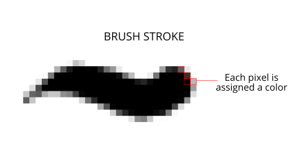

## 基础知识
---
## 栅格图像vs矢量图形？  :id=grid-vs-vector
栅格图像：
> 像素 (pixel，图像元素 Picture Element 的缩写) 是组成图像的最基础的元素。把数字图像放大后你会发现它呈网格状，每个网格单独呈现一种颜色，这些网格中的每一格就是一个像素。由像素构成的图像就是栅格图像。

矢量图形:
> 是通过数学方式记录形状的，它们并不依赖像素。它依靠**坐标点** 和**路径** 来描述图形，过程是先绘制坐标点，然后按照指定的参数描边路径，最后呈现出实际形状。

区别：

|序号|不同点|
|---|---|
|1|栅格图像放大会失真；矢量图形则不会|