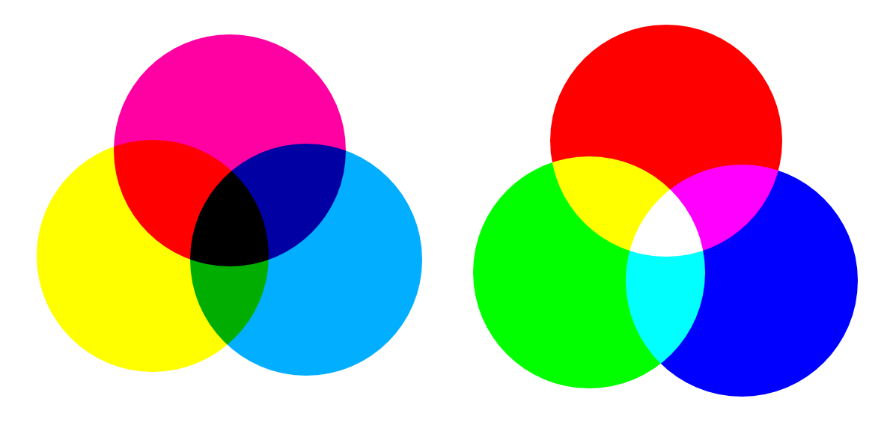

## 色彩相关知识
---
## 计算机怎么理解色彩?  :id=computer-color
色彩是人类对射入眼睛的光线的感知，而光是一种电磁波。任何物体的表面都会反射、吸收不同波长的电磁波 (光) ，不同波长的光呈现出不同的颜色。

> 左图：符合减色法原则的 CMY 色彩模型；右图：符合加色法的 RGB 色彩模型。由于两者的差异，图像在打印前都需要进行一次色彩转换。

减色法:
> 在传统绘画中我们使用颜料作画。不同的颜料会吸收不同波长的光，从而呈现出它们应有的颜色。但是混合的颜料越多，被吸收的光就越多，颜色也会变得越来越浑浊灰暗，所以我们也把颜料的混合原理叫做 减色法。基于这种原理，在传统颜料中，混色效果最好的三原色都是比较明亮的颜色：青、品红和黄 (CMY)。

RGB色彩模型:
> 计算机同样使用三原色，它通过标注一种颜色所含的三原色的数值来保存颜色。计算机的屏幕是发光体，而不同的色光在混合后会变得更加明亮，直到变为白色，所以这种混色原理又叫做 色光加色法。在计算机的使用情景里，混色效果最好的三原色是红、绿、蓝 (RGB)。

计算机以像素为单位保存颜色的三原色数值。在不同的色彩模型里面，可以显示的颜色种类与颜色的 分量 或者 通道 的位深度有关。

计算机默认使用 RGB 色彩模型，但它们也可以把颜色转换成减色法的 CMYK 模型，或者可感知的模型，如 LAB 模型。无论是哪种模型，本质上都是在描述颜色的相互关系，它们通常都会包含三个分量。灰阶图像是个例外，在这个模型里计算机只需保存一种颜色有多白，所以灰阶图像比较节省内存。

如果你把每个通道分离出来单独观察，会发现它们看起来像是一张灰阶图像，但它们实际上描述的是画面上的红、绿、蓝有多少。