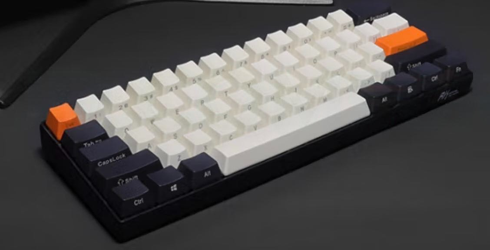

# RK61机械键盘

RK61是一个只有**61键的机械键盘**

官网：[RK61](https://www.rkgaming.com/product/11/)

## 0x01. 功能键

|组合键|功能|
|---|---|
|Fn+Q/W/E|可存储/切换三台蓝牙设备|
|Fn+左Ctrl|按键主副功能切换|
|Fn+Enter|解锁/锁定方向键|
|Fn+Win|关闭/开启Win键|
|Fn+空格|长按3秒，恢复出厂设置|
|Fn+&#124;|背光模式循环切换|
|Fn+A|切换至Win系统|
|Fn+S|切换至Mac系统|
|Fn+]}|减小背光亮度|
|Fn+[{|增加背光亮度|
|Fn+;:|减小背光变幻速度|
|Fn+‘“|增加背光变幻速度|
|背部开关OFF|有限模式|
|背部开关ON|蓝牙模式|